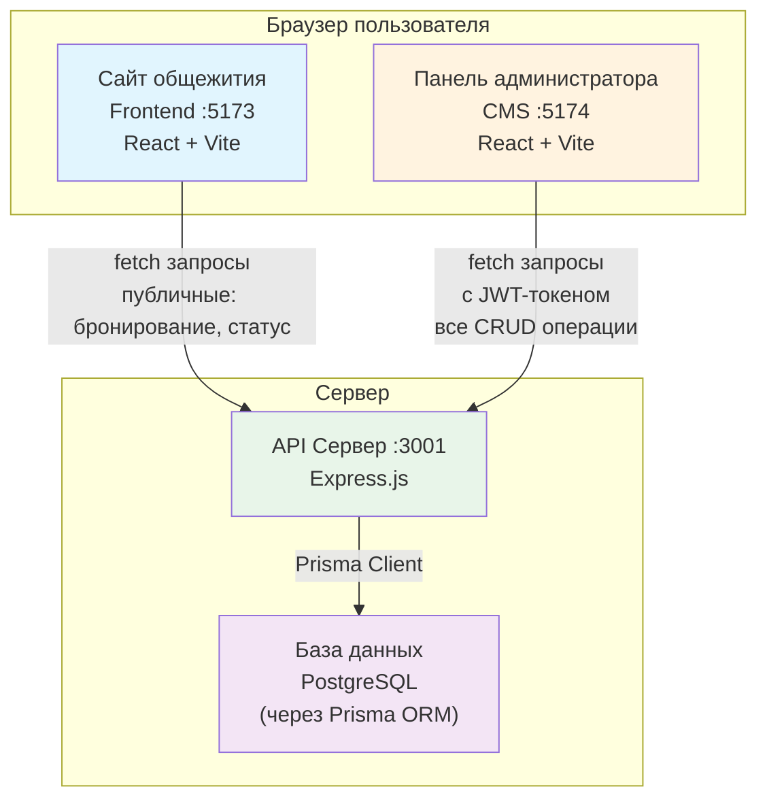
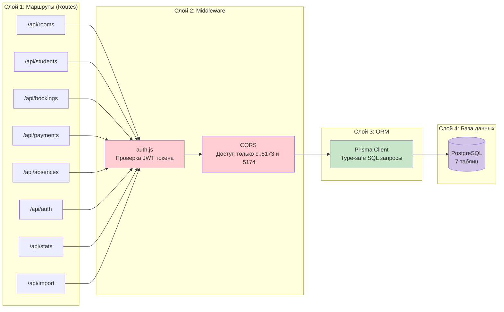
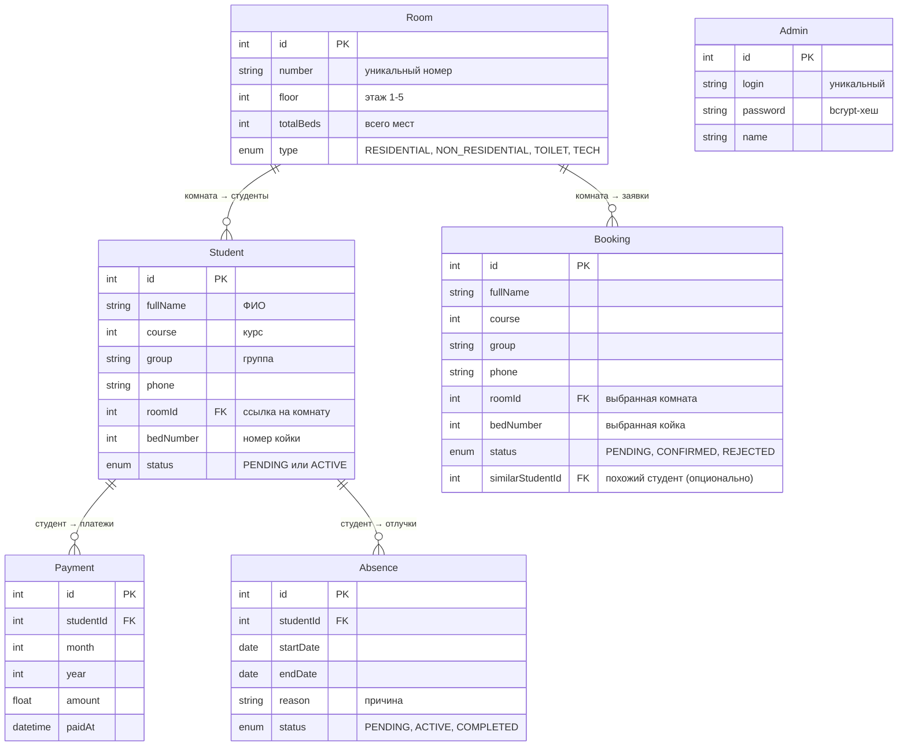
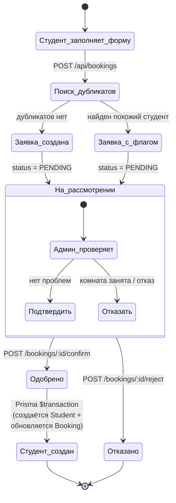
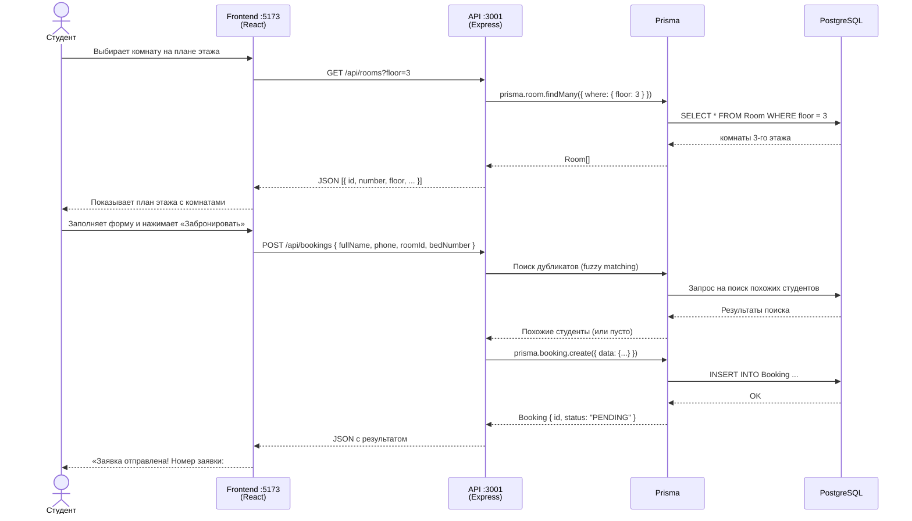
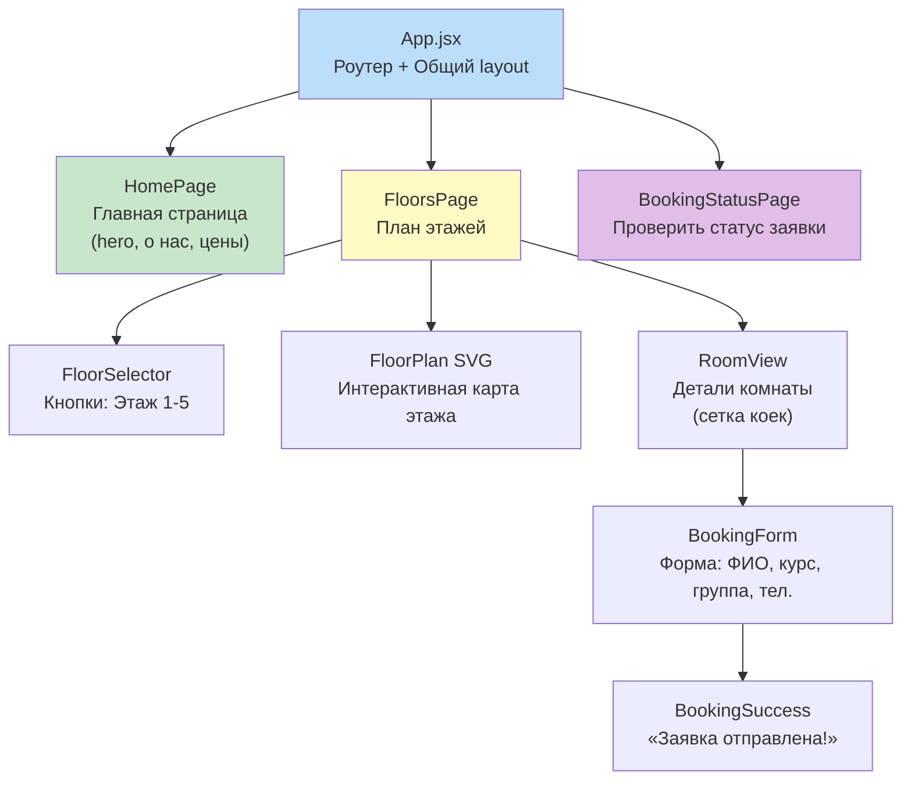
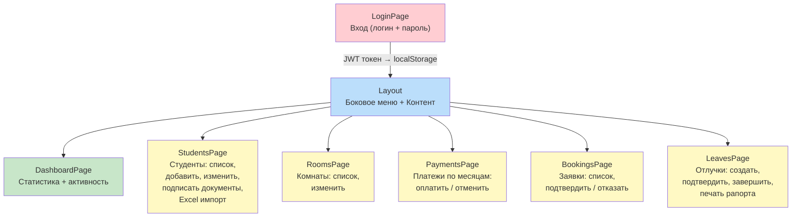
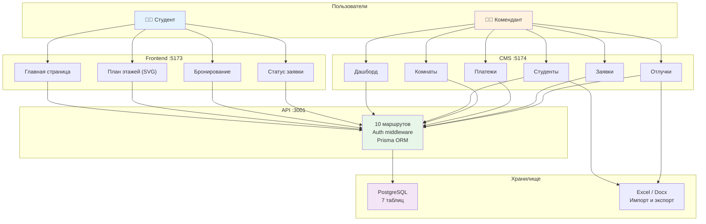

# Архитектура проекта «Автоматизированное общежитие»

## 1. Общая структура проекта (System Overview)

Проект состоит из **трёх независимых приложений**, которые общаются через один API-сервер:



### Простыми словами:
- **Frontend** (`:5173`) — это сайт, который видят **студенты**. Они могут смотреть план этажей и бронировать комнаты.
- **CMS** (`:5174`) — это админ-панель, где **комендант** управляет студентами, комнатами, платежами, заявками.
- **API** (`:3001`) — это «мозг» системы. Оба приложения шлют запросы сюда, а API уже работает с базой данных.
- **PostgreSQL** — база данных, где хранятся все записи: студенты, комнаты, бронирования, платежи.

---

## 2. Слои бэкенда (Backend Layers)

Как устроен API-сервер изнутри:



### Простыми словами:
- **Маршруты** — это «двери» в систему. Каждый URL (`/api/rooms`, `/api/bookings` и т.д.) ведёт к своей группе операций.
- **Middleware auth.js** — это «охранник». Проверяет JWT-токен: есть токен → пускает, нет → возвращает 401.
- **Middleware CORS** — разрешает запросы только с наших приложений (:5173, :5174), чужие сайты доступ не получат.
- **Prisma** — это «переводчик» между JavaScript и SQL. Вместо того чтобы писать сырые SQL-запросы, мы пишем `prisma.student.findMany()` — Prisma сама превращает это в SQL.

---

## 3. База данных (ER-диаграмма)

Семь таблиц и как они связаны:



### Простыми словами:
- **Admin** — учётка коменданта. Пароль хранится в зашифрованном виде (bcrypt).
- **Room** — комната. Бывает жилая, нежилая, туалет, техпомещение. У каждой есть этаж и количество мест.
- **Student** — студент. Привязан к комнате (`roomId`). Статус: PENDING (ждёт подписания документов) или ACTIVE (заселён).
- **Booking** — заявка на заселение. Создаётся студентом через сайт. Статус: PENDING → CONFIRMED (одобрено) или REJECTED (отказано). При подтверждении автоматически создаётся запись Student.
- **Payment** — платёж за месяц. Каждый студент платит ежемесячно. Уникальная пара `[studentId, month, year]` — нельзя заплатить дважды за один месяц.
- **Absence** — отлучка (отпуск/больничный). Статус: PENDING → ACTIVE → COMPLETED.

---

## 4. Процесс бронирования (Booking Flow)

Как студент бронирует комнату, и что делает админ:



### Простыми словами:
1. Студент заходит на сайт → выбирает этаж → видит комнаты → выбирает свободную койку → заполняет форму (ФИО, курс, группа, телефон).
2. Система **автоматически ищет дубликаты**: проверяет, нет ли уже похожего студента в базе (по ФИО и телефону). Если находит — помечает заявку флагом.
3. Заявка уходит админу со статусом **PENDING** (на рассмотрении).
4. Админ в CMS видит заявку. Может **подтвердить** (тогда автоматически создаётся студент) или **отказать**.
5. При подтверждении используется **транзакция** — либо обе операции (создать студента + обновить заявку) выполняются вместе, либо ни одна. Это защита от ошибок.

---

## 5. Поток данных (Data Flow)

Как данные проходят от пользователя до базы и обратно:



### Простыми словами:
- Студент **читает** данные (GET) — просто получает список комнат с этажа.
- Студент **отправляет** данные (POST) — создаётся заявка на бронирование.
- API **проверяет дубликаты** (fuzzy matching) перед созданием заявки — это защита от спама и ошибочных повторных заявок.
- Всё общение между Frontend и API идёт через **JSON** — самый распространённый формат данных в вебе.

---

## 6. Структура Frontend (студентский сайт)



### Простыми словами:
- **App.jsx** — это «скелет» приложения. Внутри него react-router-dom переключает страницы.
- **Главная страница** — просто информационная (hero, описание общежития, правила, контакты).
- **План этажей** — самая сложная страница. SVG-план этажа реагирует на наведение (React `useState`), показывает свободные/занятые койки.
- **Выбор комнаты → Форма → Успех** — три шага, которые студент проходит при бронировании.
- **Проверка статуса** — отдельная страница, где студент вводит ФИО и телефон, чтобы узнать судьбу своей заявки.

---

## 7. Структура CMS (админ-панель)



### Простыми словами:
- **LoginPage** — вход в админку. После входа токен сохраняется в localStorage браузера.
- **Layout** — общая обёртка с боковым меню. Все страницы внутри неё.
- **DashboardPage** — «главный экран» админа: сколько студентов, сколько свободных мест, последняя активность.
- **StudentsPage** — управление студентами: список, поиск, сортировка, добавить/изменить, импорт из Excel, подписание документов.
- **RoomsPage** — управление комнатами: изменить тип, количество мест.
- **PaymentsPage** — учёт оплат: выбрать месяц → отметить студентов, которые заплатили.
- **BookingsPage** — обработка заявок: подтвердить (создаёт студента) или отказать.
- **LeavesPage** — учёт отлучек (больничные, отпуска) и печать дежурного рапорта.

---

## 8. Единая картина (всё вместе)



### Простыми словами — вся система за 5 предложений:

1. **Студент** заходит на сайт (React), видит план этажа (SVG), выбирает комнату и бронирует койку.
2. **Комендант** заходит в админку (React CMS), видит заявку, проверяет данные студента, подтверждает или отклоняет.
3. **API-сервер** (Express.js) принимает запросы от обоих приложений, проверяет права доступа (JWT), и выполняет операции с базой данных.
4. **Prisma ORM** превращает JavaScript-код в SQL-запросы к PostgreSQL — безопасно, без риска SQL-инъекций.
5. **PostgreSQL** хранит все данные: 7 связанных таблиц (админы, комнаты, студенты, заявки, платежи, отлучки).

### Стек технологий одной строкой:
**React + Vite → Express.js → Prisma ORM → PostgreSQL**

---

## Как использовать эти диаграммы

1. **Скопируй** нужный блок кода с ` ```mermaid ... ``` `
2. **Вставь** в презентацию — Mermaid поддерживается в:
   - Obsidian (плагин)
   - Notion (через `/mermaid`)
   - GitHub/GitLab Markdown
   - VS Code (расширение Markdown Preview Mermaid)
   - [Mermaid Live Editor](https://mermaid.live) — можно сгенерировать PNG/SVG
3. Для PowerPoint/Google Slides — сгенерируй изображение через [mermaid.live](https://mermaid.live) и вставь как картинку.
