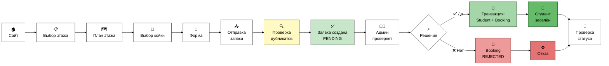

# Блок-схема бронирования (один слайд)

```mermaid
%%{init: {'theme': 'base', 'themeVariables': { 'primaryColor': '#ffffff', 'primaryTextColor': '#000000', 'primaryBorderColor': '#000000', 'lineColor': '#000000', 'secondaryColor': '#ffffff', 'tertiaryColor': '#ffffff', 'edgeLabelBackground': '#ffffff', 'fontFamily': 'Arial', 'fontSize': '18px'}}}%%
flowchart LR
    A["🏠<br/>Сайт"] --> B["📋<br/>Выбор этажа"]
    B --> C["🗺️<br/>План этажа"]
    C --> D["🚪<br/>Выбор койки"]
    D --> E["📝<br/>Форма"]
    E --> F["📤<br/>Отправка<br/>заявки"]

    F --> G["🔍<br/>Проверка<br/>дубликатов"]

    G --> H["✅<br/>Заявка создана<br/>PENDING"]

    H --> I["👩‍💼<br/>Админ<br/>проверяет"]

    I --> J{"⚡<br/>Решение"}

    J -->|"✅ Да"| K["🔄<br/>Транзакция:<br/>Student + Booking"]
    J -->|"❌ Нет"| L["📛<br/>Booking<br/>REJECTED"]

    K --> M["🎉<br/>Студент<br/>заселён"]
    L --> N["⛔<br/>Отказ"]

    M --> O["📱<br/>Проверка<br/>статуса"]
    N --> O

    style A fill:#fff,stroke:#000,color:#000
    style B fill:#fff,stroke:#000,color:#000
    style C fill:#fff,stroke:#000,color:#000
    style D fill:#fff,stroke:#000,color:#000
    style E fill:#fff,stroke:#000,color:#000
    style F fill:#fff,stroke:#000,color:#000
    style G fill:#fff9c4,stroke:#000,color:#000
    style H fill:#c8e6c9,stroke:#000,color:#000
    style I fill:#fff,stroke:#000,color:#000
    style J fill:#fff,stroke:#000,color:#000
    style K fill:#a5d6a7,stroke:#000,color:#000
    style L fill:#ef9a9a,stroke:#000,color:#000
    style M fill:#66bb6a,stroke:#000,color:#000
    style N fill:#e57373,stroke:#000,color:#000
    style O fill:#fff,stroke:#000,color:#000
```
